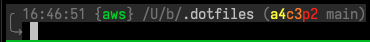
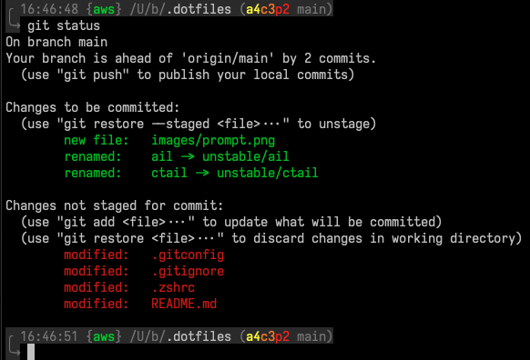

# Boyd Kane's dotfiles
This repository is not designed for general use, however you might find some
useful tid-bits if you're just looking around. I can (and do) introduce
breaking changes at any point and without warning.

At time of writing, the tools I use are:

- zsh
- git
- iTerm2
- tmux
- RaspberryPi's

## Cool Highlights

### Zsh prompt


A note on the git integration:



But it doesn't take up loads of space like I often see. If I'm in a repository,
I'll see the name of the current branch like `(main)`. If I've modified 1 files
but still need to `git add` them, then I'll see something like `(a1 main)`. If
I've also got 2 files which have been `git add`-ed but not `git commit`-ed,
then I'll see something like `(a1c2 main)`. Finally, if I've also got 3 commits
which haven't been `git push`-ed to remote, then I'll see something like
`(a1c2p3 main)`

The git part of the prompt is hidden if I'm not inside a git repository.

The `hostname` is checked, and if it's a machine I often use (raspberry pi,
personal, etc) then a colour coded abbreviation (`{mac}`, `{rpi}`, etc) is
added to the prompt. If the host isn't recognised, then the full hostname is
added to the prompt.

`ls` will be called automatically after `cd` via a function.

If I've got jobs running / stopped in the background, a little `1r` or `2s`
will be added to the prompt (for 1 running, or 2 stopped).

If authentication is needed for various tools, a single character is added to
the prompt to remind me of that.

The `pwd` is included, except it's shortened so that it doesn't take up the
whole screenwidth. The current directory is highlighted, but all higher level
directories are shortened to one character.

The prompt will include a line like `kill 3947 (86.3% /Applications/Google
Chrome.app)` if any application starts using more than 75% CPU or so.

### OS-aware install script


## TODOs

- Maybe add a timer option, where `timer 10` would start a timer in the
  background for 10 seconds and then add a readout of the timer progress to
  PROMPT?
- Add a jobs count if > 0
- Add a warning if the busiest process is using over XXX% cpu
    - This might be useful
```sh
ps aux --sort=-%cpu | awk 'NR==1{print $2,$3,$11}NR>1{if($3>=0.0) print $2,$3,$11}'
```
- Add a slim-terminal window
    - would have differennt items on different lines if the terminal window is slimmer than usual
